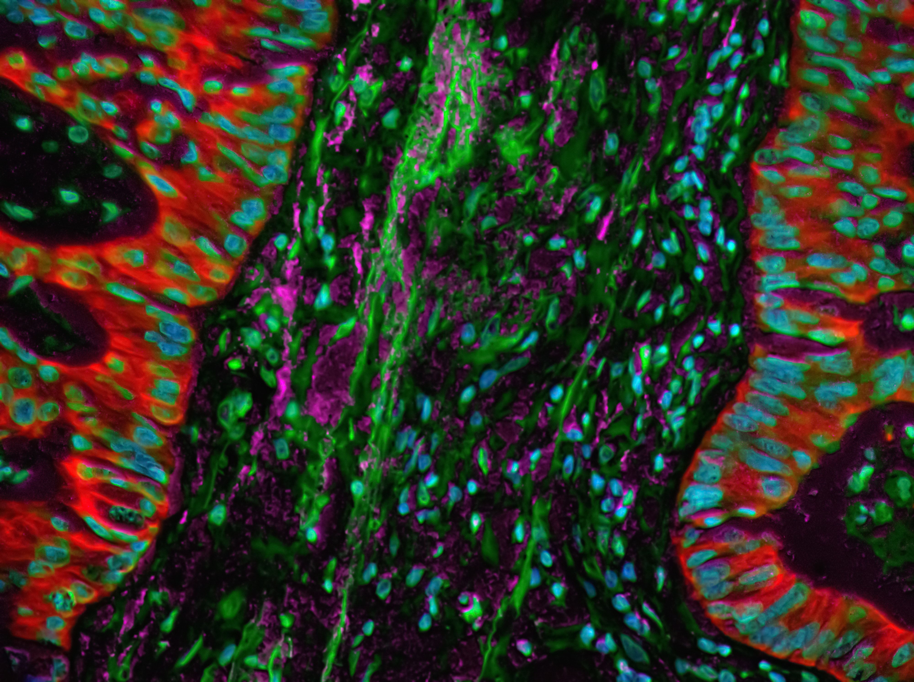
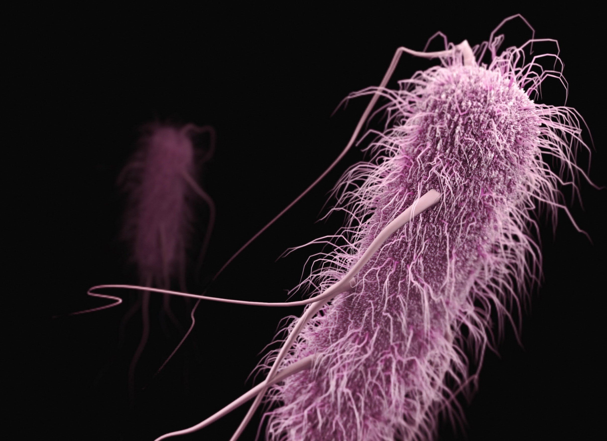
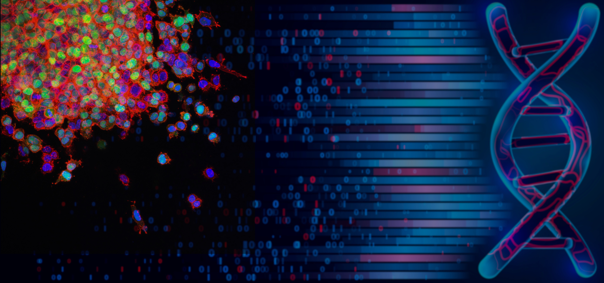

The **Integrative Bioinformatics and Biostatistics** group at RECETOX, Masaryk
University, works at the intersection of computational pathology, microbiome
research and cancer biostatistics.

::: {.grid .research-row}
::: {.g-col-12 .g-col-md-6}
{.research-img fig-alt="Multiplex fluorescence microscopy image of colon tissue"}
:::
::: {.g-col-12 .g-col-md-6}
### [Computational pathology and transcriptomics](projects.qmd)

We use deep learning for exploring whole slide images and combine the
extracted features with molecular data for gaining new insights into the
cancer universe. We were the first to demonstrate that molecular subtypes of
colon cancer can be predicted using pathology images.
:::
:::

::: {.grid .research-row}
::: {.g-col-12 .g-col-md-6}
### [Microbiome and cancer](projects.qmd)

Linking the microbiome to tumor progression. The microbiome modulates the
host immune response to cancer and plays a central role in tumor
progression. Understanding these interactions may provide prognostic and
predictive tools and hints towards novel therapeutic approaches.
:::
::: {.g-col-12 .g-col-md-6}
{.research-img fig-alt="Colored render of gut bacteria"}
:::
:::

::: {.grid .research-row}
::: {.g-col-12 .g-col-md-6}
{.research-img .research-img-wide fig-alt="Composite image of tumor cells, sequencing data and a DNA double helix"}
:::
::: {.g-col-12 .g-col-md-6}
### [Tumor heterogeneity](projects.qmd)

Bioinformatics explorations of intra-/inter-tumor heterogeneity. Both
inter-tumor and intra-tumor heterogeneity are major obstacles towards
precision medicine. We develop bioinformatics approaches combining various
*OMICS* for shedding light on this complex universe.
:::
:::

---

- [Meet the team &rarr;](people.qmd)
- [Recent news &rarr;](news/index.qmd)
- [Our publications &rarr;](publications.qmd)
- [Get in touch &rarr;](contact.qmd)
